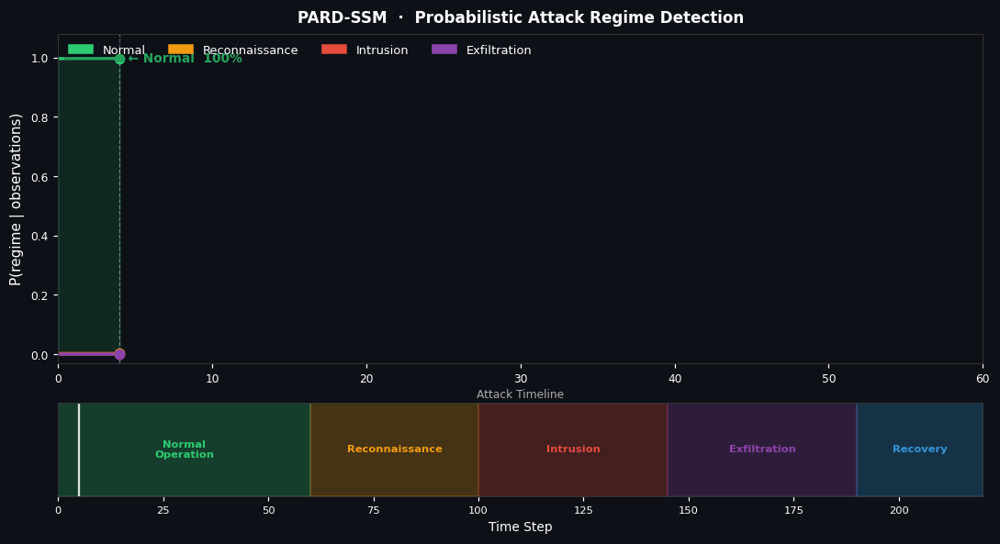

<div align="center">

<h1>
  
</h1>

<p align="center">
  
  
  
  
  
</p>

<p align="center">
  <b>Probabilistic detection and inference of changing attack regimes in network traffic<br>
  using switching state-space models.</b>
</p>

<br>



</div>

---

## What is PARD-SSM?

**PARD-SSM (Probabilistic Attack Regime Detection)** is a research project that models network traffic as a **latent dynamical system** whose underlying behavior can change between different regimes.

Instead of treating network observations as independent samples, the project models temporal dependencies between observations and uses a **switching state-space model** to infer the hidden system state and regime.

The implementation combines:

* Probabilistic state-space modeling
* Kalman filtering
* Extended and Unscented Kalman filtering
* Switching-state inference
* Variational inference
* EM-based parameter learning
* Network-traffic feature processing
* Statistical evaluation

---

## Research Objective

The central problem is to infer hidden changes in network behavior from noisy and high-dimensional traffic observations.

Let:

* $x_t$ denote the continuous latent network state,
* $s_t$ denote the discrete latent regime,
* $y_t$ denote the observed network telemetry.

The inference objective is:

```text
P(x_t, s_t | y_1:t)
```

which provides both:

* an estimate of the hidden network state, and
* a probability distribution over possible regimes.

This formulation allows the system to study **how network behavior evolves over time**, rather than relying only on isolated classification decisions.

---

## Key Features

* **Probabilistic regime tracking** — estimates a distribution over latent regimes instead of producing only a single label.
* **Multiple inference methods** — Kalman Filter, EKF, UKF, and Variational Switching inference.
* **Switching dynamics** — allows the underlying system dynamics to vary across latent regimes.
* **EM-based learning** — estimates model parameters and regime transition behavior from data.
* **Multi-dataset evaluation** — experiments are conducted using CICIDS2017 and UNSW-NB15.
* **Explainability support** — SHAP-based analysis is included for investigating feature contributions.
* **Reproducible experiments** — experiment scripts, tests, documentation, and generated results are included in the repository.

---

## Mathematical Formulation

### State Dynamics

The switching state-space formulation can be expressed as

```text
x_t = A_{s_t} x_{t-1} + w_t
```

where

```text
w_t ~ N(0, Q_{s_t})
```

and the transition dynamics depend on the latent regime $s_t$.

### Observation Model

```text
y_t = C_{s_t} x_t + v_t
```

where

```text
v_t ~ N(0, R_{s_t})
```

The observed telemetry is therefore modeled as a noisy projection of the hidden system state.

### Regime Dynamics

The discrete regime follows a Markov transition model:

```text
P(s_t = j | s_{t-1} = i) = π_ij
```

The resulting inference problem is to jointly estimate:

```text
P(x_t, s_t | y_1:t)
```

---

## Model Architecture

```text
Network Traffic
      │
      ▼
Feature Extraction & Processing
      │
      ▼
State-Space Representation
      │
      ▼
┌──────────────────────────────────────┐
│    Switching State-Space Model       │
│                                      │
│  Hidden State:   x_t ∈ R^d           │
│  Regime:         s_t                 │
│  Transition:     Π                   │
└──────────────────┬───────────────────┘
                   │
                   ▼
        ┌──────────────────────┐
        │   Inference Engine   │
        ├──────────────────────┤
        │ Kalman Filter        │
        │ EKF                  │
        │ UKF                  │
        │ Variational Switching│
        └──────────┬───────────┘
                   │
                   ▼
        Regime Probabilities
        + Hidden State Estimates
```

---

## Inference Methods

| Method                              | Model           | Main Role                    |
| ----------------------------------- | --------------- | ---------------------------- |
| **Kalman Filter**                   | Linear Gaussian | Baseline state estimation    |
| **Extended Kalman Filter**          | Nonlinear       | Local linearization          |
| **Unscented Kalman Filter**         | Nonlinear       | Sigma-point inference        |
| **Variational Switching Inference** | Switching SSM   | Joint regime/state inference |

---

## Datasets

### CICIDS2017

Used for evaluating network intrusion-detection behavior across a range of traffic and attack scenarios.

**Source:** [Canadian Institute for Cybersecurity](https://www.unb.ca/cic/datasets/ids-2017.html)

### UNSW-NB15

Used as a second benchmark for evaluating the robustness of the modeling approach across a different network-traffic distribution.

**Source:** [UNSW Canberra Cyber](https://research.unsw.edu.au/projects/unsw-nb15-dataset)

> Raw datasets are intentionally excluded from version control.
> See [`docs/dataset_guide.md`](docs/dataset_guide.md) for dataset preparation instructions.

---

## Data Processing Pipeline

```text
Raw Dataset
     │
     ▼
Dataset Loader
     │
     ▼
Feature Engineering
     │
     ▼
Normalization / Dimensionality Reduction
     │
     ▼
Temporal Windows
     │
     ▼
State-Space Inference
```

Implementation:

```text
src/data_processing/
├── dataset_loader.py
└── feature_engineering.py
```

---

## Explainability

The repository includes SHAP-based analysis for examining feature contributions to model outputs.

Implementation:

```text
src/explainablity/shap_explainer.py
```

---

## Experiments

The `experiments/` directory contains:

```text
experiments/
├── baselines.py
├── run_baseline.py
├── run_switching.py
├── evaluation_metrics.py
├── ablation_study.py
└── statistical_significance.py
```

These scripts support:

* Baseline comparisons
* Switching-model experiments
* Ablation studies
* Evaluation metrics
* Statistical significance analysis

---

## Results

Generated experimental results are available in:

```text
results/
```

including:

* Baseline comparisons
* Ablation studies
* Statistical significance analysis
* Dataset-specific visualizations

Representative visualizations are included in the repository and the project documentation.

---

## Repository Structure

```text
PARD-SSM/
│
├── docs/
│   ├── dataset_guide.md
│   ├── math_derivations.md
│   └── regime_detection.gif
│
├── experiments/
│   ├── ablation_study.py
│   ├── baselines.py
│   ├── evaluation_metrics.py
│   ├── run_baseline.py
│   ├── run_switching.py
│   └── statistical_significance.py
│
├── results/
│   ├── ablation_*.png
│   ├── baselines_*.png
│   └── significance_*.png
│
├── src/
│   ├── data_processing/
│   ├── explainablity/
│   ├── inference/
│   ├── models/
│   └── utils/
│
├── tests/
│   ├── test_data_processing.py
│   ├── test_kalman_filter.py
│   └── test_switching_ssm.py
│
├── .gitignore
├── LICENSE
├── requirements.txt
└── README.md
```

---

## Installation

```bash
git clone https://github.com/PeerAhammad/PARD-in-Network-Traffic-using-Switching-State-Space-Models.git
cd PARD-in-Network-Traffic-using-Switching-State-Space-Models
pip install -r requirements.txt
```

For isolated development, create a virtual environment before installing dependencies.

---

## Running the Project

### Baseline experiments

```bash
python experiments/run_baseline.py
```

### Switching-state experiments

```bash
python experiments/run_switching.py
```

### Statistical evaluation

```bash
python experiments/statistical_significance.py
```

### Tests

```bash
pytest tests/
```

For dataset preparation and experiment details, see:

* [`docs/dataset_guide.md`](docs/dataset_guide.md)
* [`docs/math_derivations.md`](docs/math_derivations.md)

---

## Evaluation

The project evaluates the inference methods using metrics including:

| Metric              | Purpose                                    |
| ------------------- | ------------------------------------------ |
| Regime Accuracy     | Evaluate inferred regime labels            |
| Prediction MSE      | Measure state/observation prediction error |
| Log-Likelihood      | Compare probabilistic model fit            |
| AUC-ROC             | Evaluate attack-vs-normal discrimination   |
| Detection Lead Time | Analyze temporal detection behavior        |
| Confusion Matrix    | Inspect per-regime performance             |

---

## Project Status

**Research project — submitted to NeurIPS and awaiting final decision.**

The repository contains the implementation, experiments, evaluation procedures, results, tests, and supporting mathematical documentation for the PARD-SSM research project.

---

## Citation

```bibtex
@article{hiremath2026pard,
  title={PARD-SSM: Probabilistic Cyber-Attack Regime Detection via Variational Switching State-Space Models},
  author={Hiremath, Prakul Sunil and Bhekane, Sahil and Bagawan, PeerAhammad M},
  journal={arXiv preprint arXiv:2604.02299},
  year={2026}
}
```


## License

This project is licensed under the **Apache License 2.0**.

See [`LICENSE`](LICENSE) for the full license text.

---

<div align="center">

**Research → Model → Infer → Evaluate → Understand**

</div>
